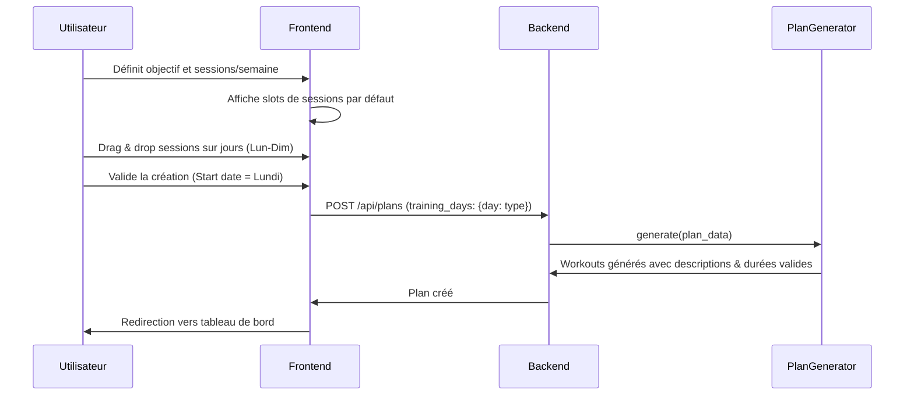

# Exigences (Requirements)

### Objectifs et Périmètre
L'objectif est d'améliorer l'expérience utilisateur et la rigueur de l'application d'entraînement en introduisant des validations strictes, de nouvelles métriques de suivi et une interface plus intuitive basée sur le drag and drop.

### Fonctionnalités Clés
- **Validations de durée** : Les séances de type "Sortie longue" et "Libre" doivent avoir une durée multiple de 5 minutes.
- **Calendrier Interactif** : Déplacement des séances par drag and drop directement dans le tableau de bord.
- **Gestion du Plan** :
    - Début de plan impérativement un lundi.
    - Possibilité pour l'athlète de supprimer son plan actif.
    - Interface de création de plan avec calendrier hebdomadaire et drag and drop pour l'affectation des jours.
- **Métriques et Contenu** :
    - Affichage de la charge hebdomadaire (somme des charges estimées).
    - Affichage de la difficulté estimée (charge) sur la fiche détaillée d'une séance.
    - Descriptions automatiques personnalisées pour les séances d'Endurance, Sortie longue et Sortie libre.

# Conception Technique (Technical Design)

### Architecture et Choix Techniques

#### Backend (Python/FastAPI)
- **Validation Pydantic** : 
    - Dans `backend/app/schemas/workout.py`, utiliser `@field_validator` sur `WorkoutBase` pour assurer que `duration_minutes` est un multiple de 5 pour les types `Sortie Longue` et `Libre`.
    - Dans `backend/app/schemas/plan.py`, ajouter un validateur pour `start_date` afin de forcer un lundi (ISO weekday 1).
    - Modifier `training_days` de `List[int]` en `Dict[int, str]` pour mapper chaque jour à un type de séance.
- **Service Generator** : 
    - Mettre à jour `PlanGenerator` pour utiliser les nouvelles descriptions statiques :
        - Sortie longue : "C’est la sortie longue de la semaine, hydratez-vous bien, prenez votre temps, faites un parcours que vous appréciez et essayez de garder un cardio bas"
        - Sortie libre : "C’est le moment détente, faites ce que vous voulez, sans regarder la montre. Essayez tout de même de ne pas générer trop de fatigue. Excellente occasion pour courir avec des amis"
        - Endurance : "Le footing de la semaine, un moment pour faire du bien à votre corps, prenez le temps de vider votre tête."
    - Appliquer la règle du multiple de 5 dans `create_workout_for_category`.
- **API** : Ajouter `DELETE /api/plans/{plan_id}` dans `backend/app/api/plans.py` qui supprime le plan et cascade vers ses entraînements (ou les supprime manuellement).

#### Frontend (Next.js/React)
- **Gestion du Drag and Drop** : Installer et intégrer `@dnd-kit/core`, `@dnd-kit/sortable` et `@dnd-kit/utilities`.
- **Tableau de Bord (`page.tsx`)** :
    - Ajouter le support DnD pour déplacer les séances entre les jours (mise à jour de la date via `PATCH /api/workouts/{id}`).
    - Calculer `totalWeeklyLoad` dans la vue par semaine en sommant `estimated_load` des séances affichées.
    - Ajouter un bouton pour supprimer le plan actuel (appel `DELETE /api/plans/{id}`).
- **Création de Plan (`plans/new/page.tsx`)** :
    - Remplacer les boutons de jours par un calendrier hebdomadaire interactif.
    - Permettre de configurer les séances via DnD.
    - Restreindre le choix de `start_date` aux lundis via l'attribut `min` ou une validation/ajustement automatique.
- **Fiche Séance (`workouts/[id]/page.tsx`)** : Afficher la charge estimée (`estimated_load`) de manière proéminente.

### Diagramme de Séquence : Création de Plan

### Risques
- **Compatibilité des données** : Le changement du format `training_days` de `List[int]` à `Dict[int, str]` doit être géré avec précaution pour ne pas casser les plans existants (migration ou fallback).
- **Complexité UI** : Le drag and drop sur mobile nécessite une implémentation soignée des "activators" de dnd-kit pour éviter les conflits avec le scroll.

# Validation et Tests (Testing)

### Approche de Validation
- **Tests de Validation Backend** : Tentatives d'insertion de données invalides (durée 42 min, début de plan un mardi) pour vérifier les codes d'erreur 422.
- **Vérification du Générateur** : Générer plusieurs types de plans (maintien, intensité) et vérifier que les descriptions et durées respectent les nouvelles règles.
- **Tests d'Interface** :
    - Vérifier que le drag and drop dans le calendrier met bien à jour la date en base de données.
    - Vérifier que la suppression du plan nettoie correctement le calendrier.
    - Comparer le calcul de la charge hebdomadaire affiché avec un calcul manuel.

# Delivery Steps

###   Step 1: Backend : Règles métier et API de suppression
Mise en œuvre des règles de validation métier et des améliorations du générateur de plan.

- Ajouter un validateur Pydantic dans `backend/app/schemas/workout.py` pour imposer des durées multiples de 5 sur les types "Sortie Longue" et "Libre".
- Ajouter un validateur dans `backend/app/schemas/plan.py` pour forcer la date de début au lundi.
- Mettre à jour `backend/app/services/plan_generator.py` pour inclure les descriptions par défaut et respecter les règles de durée.
- Modifier le générateur pour supporter un mapping détaillé des jours d'entraînement (dictionnaire jour -> type).
- Ajouter la route `DELETE /api/plans/{plan_id}` dans `backend/app/api/plans.py` pour permettre aux athlètes de supprimer leur plan.

###   Step 2: Frontend : Calendrier interactif et Charge hebdomadaire
Intégration du drag and drop dans le calendrier principal et affichage de la charge.

- Installer les dépendances `@dnd-kit/core`, `@dnd-kit/sortable` et `@dnd-kit/utilities`.
- Implémenter le drag and drop dans `frontend/src/app/page.tsx` pour permettre le déplacement des séances entre les jours.
- Calculer et afficher la somme de la charge (`estimated_load`) pour la semaine en cours dans la vue hebdomadaire.
- Ajouter un bouton de suppression de plan dans l'interface du tableau de bord.

###   Step 3: Frontend : Fiche séance et Création manuelle
Amélioration de la consultation et de la création manuelle de séances.

- Mettre à jour `frontend/src/app/workouts/[id]/page.tsx` pour afficher la charge estimée de la séance.
- Modifier `frontend/src/app/workouts/new/page.tsx` pour ajouter des contraintes de saisie sur la durée (pas de 5).
- S'assurer que la création manuelle respecte les nouvelles validations du backend.

###   Step 4: Frontend : Interface de création de plan par drag & drop
Refonte de la page de création de plan avec une interface de prévisualisation interactive.

- Remplacer la sélection simple des jours dans `frontend/src/app/plans/new/page.tsx` par une vue calendrier hebdomadaire.
- Permettre de glisser-déposer les types de séances sur les jours de la semaine pour configurer le plan.
- Restreindre le sélecteur de date de début aux lundis uniquement (ou auto-ajuster).
- Connecter l'interface au nouveau format de données `training_days` supporté par le backend.

###   Step 5: Mise à jour Docker et validation finale
Reconstruction des images Docker pour inclure les nouvelles dépendances et les changements de code.

- Reconstruire les images frontend et backend avec `docker-compose build`.
- Relancer les services avec `docker-compose up -d`.
- Effectuer une vérification end-to-end de la création de plan et du drag-and-drop sur l'instance déployée.